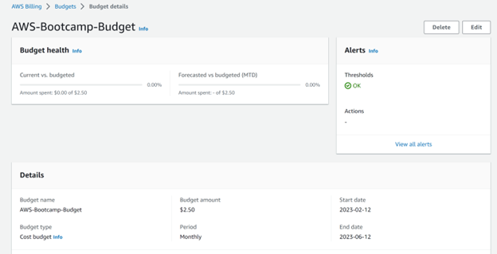
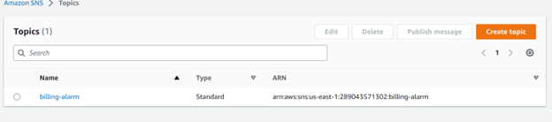
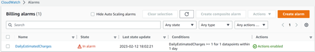

<!-- Headings -->
# My Homework: Week 0 — Billing and Architecture

# Billing
<!-- Headings -->
## INSTALLED AWS CLI TO WORKSPACE ON GITPOD
<br>

I updated the ``` .gitpod.yml``` file for automatic installation of AWS CLI on my GITPOD.IO workspace, after installing AWS CLI from the awscliv2.zip file. <br>

    gitpod /workspace $ ls -la
    total 48000
    drwxr-xr-x 8 gitpod gitpod      142 Feb 14 13:23 .
    drwxr-xr-x 1 root   root        110 Feb 14 13:23 ..
    drwxr-xr-x 3 gitpod gitpod       78 Feb 10 18:55 aws
    drwxr-xr-x 8 gitpod gitpod      144 Feb 14 13:23 aws-bootcamp-cruddur-2023
    -rw-r--r-- 1 gitpod gitpod 49149732 Feb 14 13:23 awscliv2.zip
    drwxr-xr-x 3 gitpod gitpod       17 Feb 14 13:23 .cargo
    drwxr-xr-x 2 gitpod gitpod       32 Feb 14 13:23 .gitpod
    drwxr-xr-x 4 gitpod gitpod       34 Feb 14 13:23 .pyenv_mirror
    drwx------ 4 gitpod gitpod       36 Feb 14 13:23 .vscode-remote
    gitpod /workspace $ 
<br>

## I SETUP MY AWS CREDENTIALS AND ENV Vars WITH MY AWS ACCESS KEY INFORMATION

Using ```aws sts get-caller-identity``` to print out my userId
```
{
    "UserId": "AIDAUGTCW4JTHF5AGEMT7",
    "Account": "289043571302",
    "Arn": "arn:aws:iam::289043571302:user/uche"
}

```

<!-- Headings -->
## I SETUP AWS BUDGET WITH SUBSCRIBER NOTIFICATION USING THE JSON FILES IN AWS_JSON FOLDER.
I used the script in budget.json file to configure the budget for my root AWS account.<br>
```budget.json``` in the aws_json folder.<br>
```budget-notification-with-subscriber.json``` for  budget notification with an email subscriber.
<br>




<!-- Headings -->
## I CREATED SNS TOPIC ON MY AWS Account FOR BILLING ALARM

    
    {
        TopicArn": "arn:aws:sns:us-east-1:289043571302:billing-alarm" \
    }
    


<!-- Headings -->
## I ADDED SNS SUBSCRIBE TO THE BILLING ALARM FOR AN EMAIL ENDPOINT
<br>

    --topic-arn="arn:aws:sns:us-east-1:289043571302:billing-alarm" \
    --protocol=email \
    --notification-endpoint=obichinedu@gmail.com



<!-- Headings -->
## I SETTUP ALARM FOR DAILY ESTIMATION. 
Trigers if  daily charges exceeds 1$.
<br>

json script in the aws_json folder ```alarm_config.json```
    
    aws cloudwatch put-metric-alarm --cli-input-json file://aws_json/alarm_config.json



<!-- Headings -->
# Architecture
<!--Ul-->
Architectural diagrams
<ul>
<li>

[Cruddur-Conceptual Diagram](https://lucid.app/lucidchart/9690082c-0385-407c-92d3-0f8666e493ce/edit?viewport_loc=21%2C-899%2C1635%2C782%2C0_0&invitationId=inv_7e0fee76-f62a-4042-8f1f-e00ccd3b4c8f).
    

 
</li>
<li>

[Cruddur Logical Diagram](https://lucid.app/lucidchart/393f7bd9-1f87-4954-9d30-bd21f53bd38f/edit?viewport_loc=380%2C511%2C1635%2C782%2C0_0&invitationId=inv_6d2bb1e0-909c-4ee7-a4f7-7f3927b995b8).


</li>
</ul>
