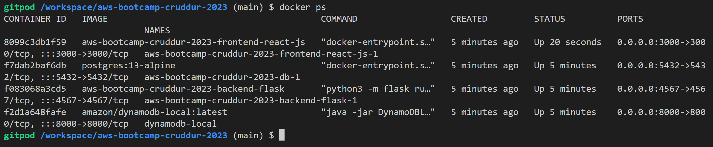

# Week 1 Homework — Docker and App Containerization

## Backend Containerization

I created a file on backend-flask dir: <br>
``` backend-flask/Dockerfile ``` <br>

 <br>

I used the docker syntax below to build the backend-flask container <br>

``` docker build -t  backend-flask ./backend-flask ``` <br>

Which is running on the background. <br>

 <br>

## Container Images or Running Container Ids

I used ``` docker container run --rm -p 4567:4567 -d backend-flask ``` to print my container Id. <br>

 <br>

## My containers list and images

``` docker ps ``` <br>

 <br>

``` docker image ``` <br>

 <br>

