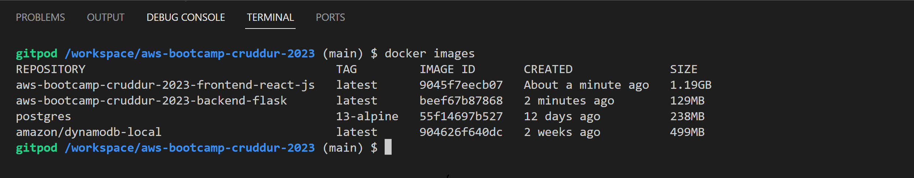
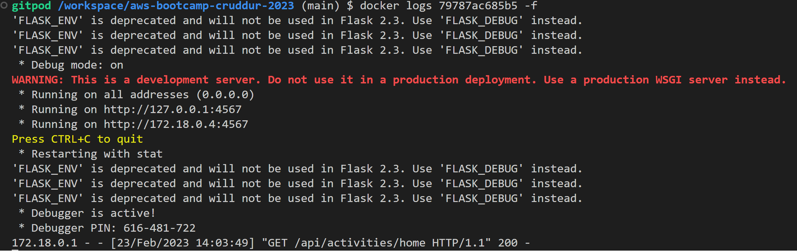

# Week 1 Homework — Docker and App Containerization

## Backend Containerization

I created a file on backend-flask dir: <br>
``` backend-flask/Dockerfile ``` <br>

 <br>

I used the docker syntax below to build the backend-flask container <br>

``` docker build -t  backend-flask ./backend-flask ``` <br>

Which is running on the background. <br>

 <br>

## Container Images or Running Container Ids

I used ``` docker container run --rm -p 4567:4567 -d backend-flask ``` to print my container Id. <br>

 <br>

## My containers list and images

``` docker ps ``` <br>

 <br>

``` docker image ``` <br>

 <br>

## Test Server using Curl

I run a test to the server using Curl command <br>

``` curl -X GET http://localhost:4567/api/activities/home -H "Accept: application/json" -H "Content-Type: application/json" ``` <br>
### Print out
    
        [
          {
            "created_at": "2023-02-21T14:03:49.568691       +00:00",
            "expires_at": "2023-02-28T14:03:49.568691       +00:00",
            "handle": "Chinedu Obi",
            "likes_count": 5,
            "message": "cloud is the future!",
            "replies": [
              {
                "created_at": "2023-02-21T14:03:49.568691       +00:00",
                "handle": "worf",
                "likes_count": 0,
                "message": "this post has no honor!",
                "replies_count": 0,
                "reply_to_activity_uuid":       "68f126b0-1ceb-4a33-88be-d90fa7109eee",
                "reposts_count": 0,
                "uuid":         "26e12864-1c26-5c3a-9658-97a10f8fea67"
              }
            ],
            "replies_count": 1,
            "reposts_count": 0,
            "uuid": "68f126b0-1ceb-4a33-88be-d90fa7109eee"
          },
          {
            "created_at": "2023-02-16T14:03:49.568691       +00:00",
            "expires_at": "2023-03-04T14:03:49.568691       +00:00",
            "handle": "worf",
            "likes": 0,
            "message": "i am out of prune juice",
            "replies": [],
            "uuid": "66e12864-8c26-4c3a-9658-95a10f8fea67"
          },
          {
            "created_at": "2023-02-23T13:03:49.568691       +00:00",
            "expires_at": "2023-02-24T02:03:49.568691       +00:00",
            "handle": "garek",
            "likes": 0,
            "message": "my dear doctor, i am just simple        tailor",
            "replies": [],
            "uuid": "248959df-3079-4947-b847-9e0892d1bab4"
          }
        ]
### Docker Logs checks

Docker container ID: 79787ac685b5 <br>
Using ``` docker logs 79787ac685b5 -f ```  or right click on the container in the Docker extension ---> View logs <br>
 <br>

### Debugging

I ran below debugging 

``` docker run --rm -it curlimages/curl "-X GET http://localhost:4567/api/activities/home -H \"Accept: application/json\" -H \"Content-Type: application/json\"" ``` <br>

 <br>

## Frontend Containerization

I created ``` Dockerfile ``` frontend-react-js dir.<br>

    FROM node:16.18
    ENV PORT=3000
    COPY . /frontend-react-js
    WORKDIR /frontend-react-js
    RUN npm install -g npm@9.5.1
    EXPOSE ${PORT}
    CMD ["npm", "start"]

<br>
Successfully built the container using ``` docker build -t frontend-react-js ./frontend-react-js ``` <br>

    Sending build context to Docker daemon          267.7MB
     .........
    Successfully built e21787c4790d
    Successfully tagged 
    frontend-react-js:latest
<br>
### Run the container
Run the container ``` docker run -p 3000:3000 -d frontend-react-js ``` <br>

## Multiple Containers

Right click on the created ``` docker-compose.yml ``` at the root of my project and clicke on compose up to run multiple containers (frondend and backend). <br>

 <br>

# DynamoDB Local and Postgres

I integrated DynamoDB Local and Postgres by updating the services and volu on the ``` docker-compose.yml ``` file.

### DynamoDB Local
 <br>

### Postgres
 <br>

# DockerHub

I created repos on docker hub ``` Sword2yk\aws-bootcamp-cruddur-2023 ``` and pushed image tags to DockerHub <br>

[My Docker hub Repo](https://hub.docker.com/r/sword2yk/aws-bootcamp-cruddur-2023/tags) <br>

 <br>

## Multi-stage building for a Dockerfile build

My sample code <br>
python helloworld file ``` a.py ``` 
a.py file 

    print(f'Hello Chinedu welcome to docker world')
    
Dockerfile <br>
 <br>

Multi-Stage Docker images on my local machine <br>
 <br>

## Healthcheck implemented on the V3 Docker compose file

[Docker compose file](https://github.com/Sword2yk/aws-bootcamp-cruddur-2023/blob/main/docker-compose.yml)

