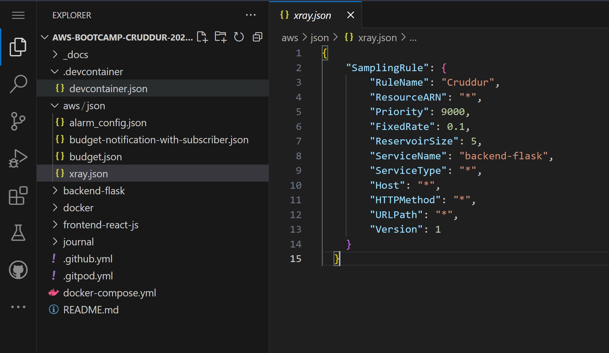
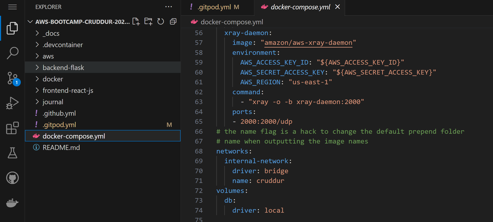
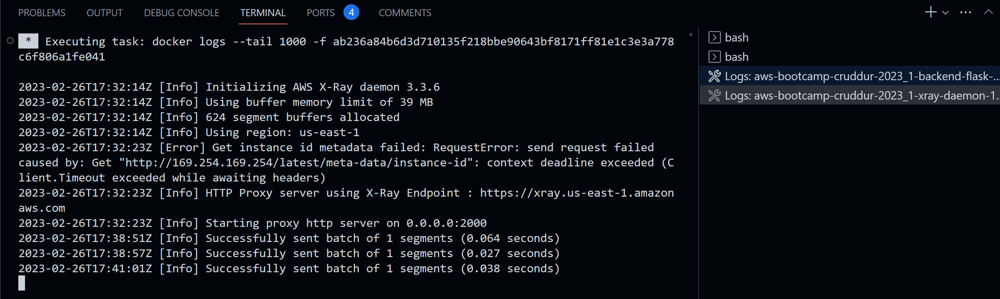

# Week 2 — Homework Challenge (Observability)
# Distributed Tracing
Distributed tracing gives you insight into how a particular service is performing as part of the whole in a distributed software system (microservices system).<br>

## X-Ray Implementation

AWS X-Ray makes it easy for developers to analyze the behavior of their distributed applications by providing request tracing, exception collection, and profiling capabilities.

### X-Ray Implementation
I installed the required python package for X-Ray ``` aws-xray-sdk ``` from running 
``` pip install -r requirements.txt ``` in the backend-flask folder. <br>

Update my ``` app.py file ``` in the backend-flask folder with the python code below. <br>

import ```xray_recorder``` and ```XRayMiddleware``` from aws_xray package.

```XRayMiddleware``` provides the intereaction between the application with its segment.

    from aws_xray_sdk.core import xray_recorder
    from aws_xray_sdk.ext.flask.middleware import XRayMiddleware
   
    xray_url = os.getenv("AWS_XRAY_URL")
    xray_recorder.configure(service='Cruddur', dynamic_naming=xray_url)
    XRayMiddleware(app, xray_recorder)
    
Add a new .json file to json folder in aws dictionary for AWS X-Ray Resources.

AWS X-Ray Resources
 <br>

### AWS XRAY GROUP

Create AWS Xray group for collection of traces. I used below AWS CLI command ```aws xray create-group``` <br>
Group name 'Crudder' <br>
Service 'backend-flask' <br>

    aws xray create-group \
       --group-name "Cruddur" \
       --filter-expression "service(\"backend-flask\") {fault OR error}"

X-ray Traces - Group


### AWS XRAY SAMPLING RULE

A sampling rule specifies which requests X-Ray should record for your API. By customizing sampling rules, you can control the amount of data that you record, and modify sampling behavior on the fly without modifying or redeploying your code.<br>
<br>
Run below sampling rule script on AWS CLI to create a sampling rule via API.

    aws xray create-sampling-rule --cli-input-json file://aws/json/xray.json

AWS X-Ray Traces - Sampling Rule


### X-Ray daemon on Amazon ECS
The AWS X-Ray daemon is a software application that listens for traffic on UDP port 2000, gathers raw segment data, and relays it to the AWS X-Ray API.<br>

Create a Docker image that runs the X-Ray daemon, upload it to a Docker image repository, and then deploy my Amazon ECS cluster.
Steps:
Add below Deamon Service to Docker Compose.

    xray-daemon:
    image: "amazon/aws-xray-daemon"
    environment:
      AWS_ACCESS_KEY_ID: "${AWS_ACCESS_KEY_ID}"
      AWS_SECRET_ACCESS_KEY: "${AWS_SECRET_ACCESS_KEY}"
      AWS_REGION: "us-east-1"
    command:
      - "xray -o -b xray-daemon:2000"
    ports:
      - 2000:2000/udp
 
 Update AWS X-RAY Docker compose environment ```docker-compose.yml```.
 
    AWS_XRAY_URL: "*4567-${GITPOD_WORKSPACE_ID}.${GITPOD_WORKSPACE_CLUSTER_HOST}*"
    AWS_XRAY_DAEMON_ADDRESS: "xray-daemon:2000"

X-Ray daemon in the docker compose file.


### AWS X-Ray daemon Docker logs
Docker logs for AWS X-Ray daemon.<br>
Sucessfully sending traces to AWS X-Ray via the API.



### AWS X-Ray segment
A trace segment records information about the original request, information about the work that your application does locally, and subsegments with information about downstream calls that your application makes to AWS resources, HTTP APIs, and SQL databases.<br>

X-Ray segment for backend-flask app


### AWS X-Ray subsegment
Subsegments provide more granular timing information and details about downstream calls that the application made to fulfill the original request.

## HoneyComb
Instrumentation of Flask app with OpenTelemetry for easy observability.

Add below to instrument a Flask app with OpenTelemetry in the ```requirements.txt```.

        opentelemetry-api
        opentelemetry-sdk
        opentelemetry-exporter-otlp-proto-http
        opentelemetry-instrumentation-flask
        opentelemetry-instrumentation-requests

Run ```pip install -r requirements.txt``` to install the dependencies.

    ....backend-flask\pip install -r requirements.txt

Add below in the ```app.py``` file.
Tracing and importing instrumentation packages.

    from opentelemetry import trace
    from opentelemetry.instrumentation.flask import FlaskInstrumentor
    from opentelemetry.instrumentation.requests import RequestsInstrumentor
    from opentelemetry.exporter.otlp.proto.http.trace_exporter import OTLPSpanExporter
    from opentelemetry.sdk.trace import TracerProvider
    from opentelemetry.sdk.trace.export import BatchSpanProcessor
    from opentelemetry.sdk.trace.export import ConsoleSpanExporter, SimpleSpanProcessor

Initialize tracing and an exporter that can send data to Honeycomb.

    provider = TracerProvider()
    processor = BatchSpanProcessor(OTLPSpanExporter())
    provider.add_span_processor(processor)
    trace.set_tracer_provider(provider)
    tracer = trace.get_tracer(__name__)

Initialize automatic instrumentation with Flask.

    app = flask.Flask(__name__)
    FlaskInstrumentor().instrument_app(app)
    RequestsInstrumentor().instrument()

Add below to the environment variables to backend-flask in docker compose ```docker-compose.yml```

    OTEL_EXPORTER_OTLP_ENDPOINT: "https://api.honeycomb.io"
    OTEL_EXPORTER_OTLP_HEADERS: "x-honeycomb-team=${HONEYCOMB_API_KEY}"
    OTEL_SERVICE_NAME: "backend-flask"
  
  ### SPIN: Sending traces to honeycomb.io

            "name": "/api/activities/home",
            "context": {
                "trace_id": "0x1519da519fa47d493dc03df46b542988",
                "span_id": "0xbfd4cfa758e44146",
                "trace_state": "[]"
            },
            "kind": "SpanKind.SERVER",
            "parent_id": null,
            "start_time": "2023-03-04T14:01:40.599940Z",
            "end_time": "2023-03-04T14:01:40.601739Z",
            "status": {
                "status_code": "UNSET"
            },
            "attributes": {
                "http.method": "GET",
                "http.server_name": "0.0.0.0",
                "http.scheme": "http",
                "net.host.port": 4567,
                "http.host": "localhost",
                "http.target": "/api/activities/home",
                "net.peer.ip": "172.18.0.1",
                "http.user_agent": "Mozilla/5.0 (Windows NT 10.0; Win64; x64) AppleWebKit/537.36 (KHTML, like Gecko) Chrome/110.0.0.0 Safari/537.36",
                "net.peer.port": 51796,
                "http.flavor": "1.1",
                "http.route": "/api/activities/home",
                "http.status_code": 200
            },
            "events": [],
            "links": [],
            "resource": {
                "attributes": {
                    "telemetry.sdk.language": "python",
                    "telemetry.sdk.name": "opentelemetry",
                    "telemetry.sdk.version": "1.16.0",
                    "service.name": "backend-flask"
                },
                "schema_url": ""
            }
        }
        172.18.0.1 - - [04/Mar/2023 14:01:40] "GET /api/activities/home HTTP/1.1" 200 -

