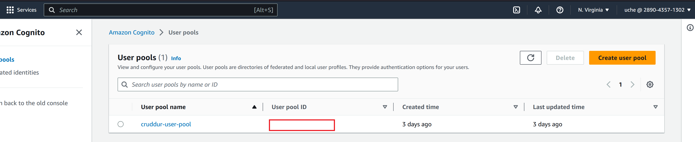
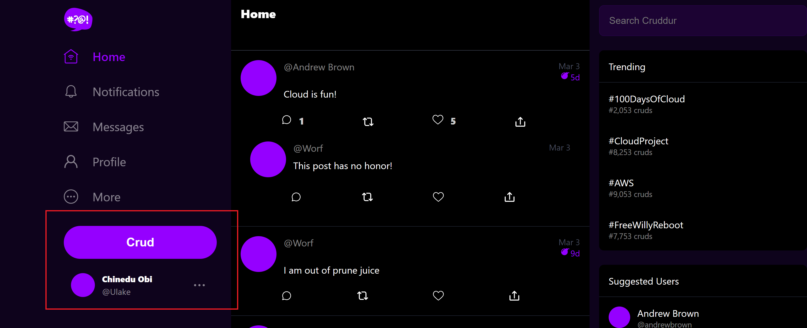
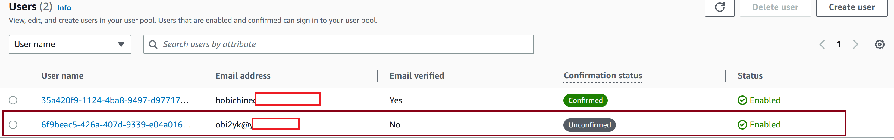
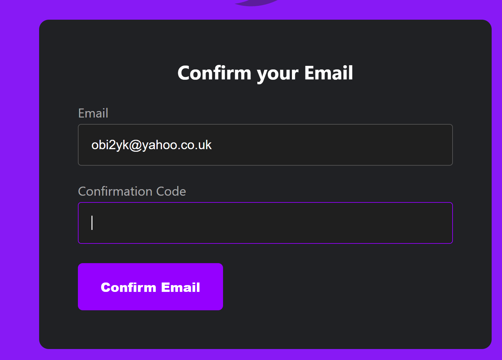
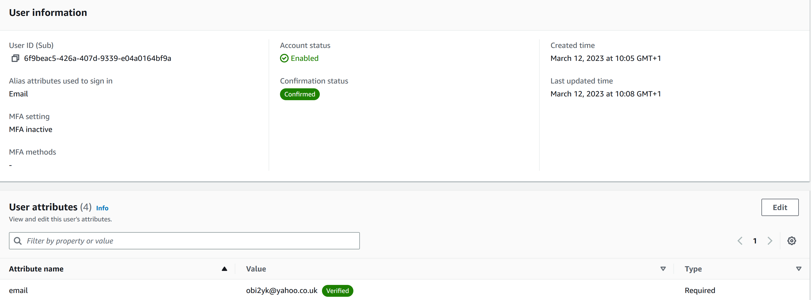
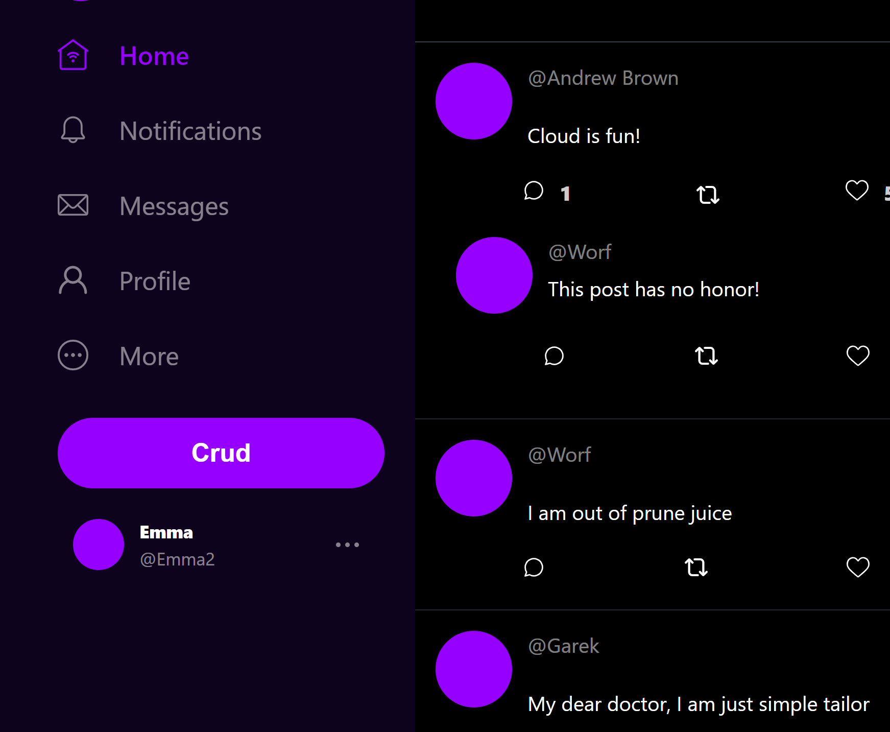

# Week 3 — Decentralized Authentication
## Required Homework

## Amazon Cognito

Amazon Cognito handles user authentication and authorization for your web and mobile apps. With user pools, you can easily and securely add sign-up and sign-in functionality to your apps. With identity pools (federated identities), your apps can get temporary credentials that grant users access to specific AWS resources, whether the users are anonymous or are signed in. <br>

### Creating a Cognito user pool
<ol>
<li>

  Logon [Amazon Cognito console](https://console.aws.amazon.com/cognito/home).If prompted, enter your AWS credentials.<br></li>
<li>  
Choose User Pools.<br></li>
<li>
Choose Create a user pool to start the user pool creation wizard. In the top-right corner of the page.<br></li>
<li>    
In Configure sign-in experience, choose the ```Cognito user pool``` options: ```Email```.<br></li>
<li>
In Configure security requirements, choose ```No MFA```, and ```Email only``` for Delivery method for user account recovery         messages.<br></li>
<li>
In Configure sign-up experience, determine how new users will verify their identities when signing up, and which attributes should be required or optional during the user sign-up flow. Required attribute (Additional required attributes) drop down menu select ```name``` and ```preferred_username```.</li>
<li>
In Configure message delivery, configure integration with Amazon Simple Email Service to send email to your users for sign-up, account confirmation and account recovery. Select the option ```Send email with Cognito``` .<br></li>
<li>
In Integrate your app, name your user pool, configure the hosted UI, and create an app client. Enter the User pool name and App client name.<br>  </li>
<li>  
Review your choices in the Review and create screen and modify any selections you wish to. When you are satisfied with your user pool configuration, select Create user pool to proceed.<br></li>
<li>
Result below.
Cognito User pools<br>
  
   </li>

## AWS Amplify

AWS Amplify is a complete solution that lets frontend web and mobile developers easily build, ship, and host full-stack applications on AWS, with the flexibility to leverage the breadth of AWS services as use cases evolve.<br>

### Install AWS Amplify

On the frontend-react-js folder install ASW Amplify ```npm i aws-amplify --save``` <br>
```package.json``` file
```json
      ....
        {
          "name": "frontend",
          "version": "0.1.0",
          "private": true,
          "dependencies": {
            "@testing-library/jest-dom": "^5.16.5",
            "@testing-library/react": "^13.4.0",
            "@testing-library/user-event": "^13.5.0",
            "aws-amplify": "^5.0.17",
            "js-cookie": "^3.0.1",
            "luxon": "^3.1.0",
            "process": "^0.11.10",
            "react": "^18.2.0",
            "react-dom": "^18.2.0",
            "react-router-dom": "^6.4.3",
            "react-scripts": "5.0.1",
            "web-vitals": "^2.1.4"
          },
      ....
  ```
  
  Add AWS Amplify to ```App.js``` file in the ```/frontend-react-js/src/ ``` directory.
  ```js
        Amplify.configure({
          "AWS_PROJECT_REGION": process.env.REACT_APP_AWS_PROJECT_REGION,
          "aws_cognito_region": process.env.REACT_APP_AWS_COGNITO_REGION,
          "aws_user_pools_id": process.env.REACT_APP_AWS_USER_POOLS_ID,
          "aws_user_pools_web_client_id": process.env.REACT_APP_CLIENT_ID,
          "oauth": {},
          Auth: {
            // We are not using an Identity Pool
            // identityPoolId: process.env.REACT_APP_IDENTITY_POOL_ID, // REQUIRED - Amazon Cognito Identity Pool ID
            region: process.env.REACT_APP_AWS_PROJECT_REGION,           // REQUIRED - Amazon Cognito Region
            userPoolId: process.env.REACT_APP_AWS_USER_POOLS_ID,         // OPTIONAL - Amazon Cognito User Pool ID
            userPoolWebClientId: process.env.REACT_APP_CLIENT_ID,   // OPTIONAL - Amazon Cognito Web Client ID (26-char alphanumeric string)
          }
        });
  ```

## logged in or logged out
 Add Amplify configuration with access token to ```HomeFeedPage.js``` file in the ```/frontend-react-js/src/ ``` directory.<br>
   
  ```js

    import { Auth } from 'aws-amplify';
        const loadData = async () => {
      try {
        const backend_url = `${process.env.REACT_APP_BACKEND_URL}/api/activities/home`
        const res = await fetch(backend_url, {
          headers: {
            Authorization: `Bearer ${localStorage.getItem("access_token")}`
          },
          method: "GET"
        });
        let resJson = await res.json();
        if (res.status === 200) {
          setActivities(resJson)
        } else {
          console.log(res)
        }
      } catch (err) {
        console.log(err);
      }
    };

    const checkAuth = async () => {
      Auth.currentAuthenticatedUser({
        // Optional, By default is false. 
        // If set to true, this call will send a 
        // request to Cognito to get the latest user data
        bypassCache: false 
      })
      .then((user) => {
        console.log('user',user);
        return Auth.currentAuthenticatedUser()
      }).then((cognito_user) => {
          setUser({
            display_name: cognito_user.attributes.name,
            handle: cognito_user.attributes.preferred_username
          })
      })
      .catch((err) => console.log(err));
    };

    React.useEffect(()=>{
      //prevents double call
      if (dataFetchedRef.current) return;
      dataFetchedRef.current = true;

      loadData();
      checkAuth();
    }, [])
  ```

### Modifiy the [DesktopNavigation.js](https://github.com/Sword2yk/aws-bootcamp-cruddur-2023/blob/main/frontend-react-js/src/components/DesktopSidebar.js) to conditionally shows links in the left hand column on whether the users are logged in or not.<br>

  ```js
  
   import './DesktopSidebar.css';
   import Search from '../components/Search';
   import TrendingSection from '../components/TrendingsSection'
   import SuggestedUsersSection from '../components/SuggestedUsersSection'
   import JoinSection from '../components/JoinSection'
   
   export default function DesktopSidebar(props) {
     const trendings = [
       {"hashtag": "100DaysOfCloud", "count": 2053 },
       {"hashtag": "CloudProject", "count": 8253 },
       {"hashtag": "AWS", "count": 9053 },
       {"hashtag": "FreeWillyReboot", "count": 7753 }
     ]
   
     const users = [
       {"display_name": "Andrew Brown", "handle": "andrewbrown"}
     ]
   
     let trending;
     let suggested;
     let join;
     if (props.user) {
       trending = <TrendingSection trendings={trendings} />
       suggested = <SuggestedUsersSection users={users} />
     } else {
       join = <JoinSection />
     }
   
     return (
       <section>
         <Search />
         {trending}
         {suggested}
         {join}
         <footer>
           <a href="#">About</a>
           <a href="#">Terms of Service</a>
           <a href="#">Privacy Policy</a>
         </footer>
       </section>
     );
   }
  ```
 
  Desktop Navigation
 

### Enable signing in with a cognito username, [SigninPage.js](https://github.com/Sword2yk/aws-bootcamp-cruddur-2023/blob/main/frontend-react-js/src/pages/SigninPage.js) file.<br>

import Amplify and the ```SigninPage.js``` file modified below.<br>
  
  ```js
    ...
    import { Auth } from 'aws-amplify';
    ...
    const [email, setEmail] = React.useState('');
    const [password, setPassword] = React.useState('');
    const [errors, setErrors] = React.useState('');
  
    const onsubmit = async (event) => {
      setErrors('')
      event.preventDefault();
      Auth.signIn(email, password)
      .then(user => {
        console.log('user',user)
        localStorage.setItem("access_token", user.signInUserSession.accessToken.jwtToken)
        window.location.href = "/"
      })
      .catch(error => { 
        if (error.code == 'UserNotConfirmedException') {
          window.location.href = "/confirm"
        }
        setErrors(error.message)
      });
      return false
    }
  
    const email_onchange = (event) => {
      setEmail(event.target.value);
    }
    const password_onchange = (event) => {
      setPassword(event.target.value);
    }
  
    let el_errors;
    if (errors){
      el_errors = <div className='errors'>{errors}</div>;
    }
    ...
```
  
### Enabling Cogito for new user signup on [Signup Page](https://github.com/Sword2yk/aws-bootcamp-cruddur-2023/blob/main/frontend-react-js/src/pages/SignupPage.js).
  
Integrate Amplify to the ```Signup Page.js``` file.<br>
  
```js
     ...
     import { Auth } from 'aws-amplify';
     ...
     const onsubmit = async (event) => {
      event.preventDefault();
      setErrors('')
      console.log('username',username)
      console.log('email',email)
      console.log('name',name)
      try {
        const { user } = await Auth.signUp({
          username: email,
          password: password,
          attributes: {
            name: name,
            email: email,
            preferred_username: username,
          },
          autoSignIn: { // optional - enables auto sign in after user is confirmed
            enabled: true,
          }
        });
        console.log(user);
        window.location.href = `/confirm?email=${email}`
      } catch (error) {
          console.log(error);
          setErrors(error.message)
      }
      return false
    }
  
    const name_onchange = (event) => {
      setName(event.target.value);
    }
    const email_onchange = (event) => {
      setEmail(event.target.value);
    }
    const username_onchange = (event) => {
      setUsername(event.target.value);
    }
    const password_onchange = (event) => {
      setPassword(event.target.value);
    }
  
    let el_errors;
    if (errors){
      el_errors = <div className='errors'>{errors}</div>;
    }
    ...
  ```

### Confirmation Page To Send or Resend Activiation Code to a User. [Confirmation Page](https://github.com/Sword2yk/aws-bootcamp-cruddur-2023/blob/main/frontend-react-js/src/pages/ConfirmationPage.js).
 
  Integrate Amplify to the ```ConfirmationPage.js``` file for the user to recieve the activation code during signup or account recovery.<br>
 
 ```js
    ...
    import { Auth } from 'aws-amplify';
    ...
      export default function ConfirmationPage() {
      const [email, setEmail] = React.useState('');
      const [code, setCode] = React.useState('');
      const [errors, setErrors] = React.useState('');
      const [codeSent, setCodeSent] = React.useState(false);
    
      const params = useParams();
    
      const code_onchange = (event) => {
        setCode(event.target.value);
      }
      const email_onchange = (event) => {
        setEmail(event.target.value);
      }
    
      const resend_code = async (event) => {
        setErrors('')
        try {
          await Auth.resendSignUp(email);
          console.log('code resent successfully');
          setCodeSent(true)
        } catch (err) {
          // does not return a code
          // does cognito always return english
          // for this to be an okay match?
          console.log(err)
          if (err.message == 'Username cannot be empty'){
            setCognitoErrors("You need to provide an email in order to send Resend Activiation Code")   
          } else if (err.message == "Username/client id combination not found."){
            setCognitoErrors("Email is invalid or cannot be found.")   
          }
        }
      }
    
      const onsubmit = async (event) => {
        event.preventDefault();
        setErrors('')
        try {
          await Auth.confirmSignUp(email, code);
          window.location.href = "/"
        } catch (error) {
          setErrors(error.message)
        }
        return false
      }
    
      let el_errors;
      if (errors){
        el_errors = <div className='errors'>{errors}</div>;
      }
    
    
      let code_button;
      if (codeSent){
        code_button = <div className="sent-message">A new activation code has been sent to your email</div>
      } else {
        code_button = <button className="resend" onClick={resend_code}>Resend Activation Code</button>;
      }
    
      React.useEffect(()=>{
        if (params.email) {
          setEmail(params.email)
        }
      }, [])
      ...
  ```
### User Account recovery. [Recovery Page](https://github.com/Sword2yk/aws-bootcamp-cruddur-2023/blob/main/frontend-react-js/src/pages/RecoverPage.js).
  Integrate Amplify to the ```RecoverPage.js``` file to enble user account recovery.<br>
  
  ```js
      ...
      import { Auth } from 'aws-amplify';
  
      ...
  
        const onsubmit_send_code = async (event) => {
        event.preventDefault();
        setErrors('')
        Auth.forgotPassword(username)
        .then((data) => setFormState('confirm_code') )
        .catch((err) => setErrors(err.message) );
      return false
      }
      const onsubmit_confirm_code = async (event) => {
        event.preventDefault();
        setErrors('')
        if (password == passwordAgain){
          Auth.forgotPasswordSubmit(username, code, password)
          .then((data) => setFormState('success'))
          .catch((err) => setErrors(err.message) );
        } else {
          setCognitoErrors('Passwords do not match')
      }
      return false
    }
  ...
  ```
### To Allow User Profile Cleanup After Sign-out.[ProfileInfo](https://github.com/Sword2yk/aws-bootcamp-cruddur-2023/blob/main/frontend-react-js/src/components/ProfileInfo.js).
Import Amplify to the ```rofileInfo.js```file and replace the signOut method with.<br>
  ```js
    ...
    import { Auth } from 'aws-amplify';
    
    export default function ProfileInfo(props) {
      const [popped, setPopped] = React.useState(false);
    
      const click_pop = (event) => {
        setPopped(!popped)
      }
    
      const signOut = async () => {
        try {
            await Auth.signOut({ global: true });
            window.location.href = "/"
            localStorage.removeItem("access_token")
        } catch (error) {
            console.log('error signing out: ', error);
        }
      }
    
      const classes = () => {
        let classes = ["profile-info-wrapper"];
        if (popped == true){
          classes.push('popped');
        }
        return classes.join(' ');
      }
    ...
  
  ```
  
### Modify Flask CORS on ```app.py``` file.
  ```app.py``` in the /backend-flask/ directory.
  
  ```py
      ...
      cors = CORS(
      app, 
      resources={r"/api/*": {"origins": origins}},
      headers=['Content-Type', 'Authorization'], 
      expose_headers='Authorization',
      methods="OPTIONS,GET,HEAD,POST"
      )
     ...
  ```

## Update the Environment variables for Frontend and Backend.
### Unset the existing environment AWS variables.<br>
  
  ```yaml
      unset AWS_SECRET_ACCESS_KEY
      unset AWS_SECRET_KEY
      unset AWS_SESSION_TOKEN
      unset AWS_ACCESS_KEY_ID
  ```
Set the new AWS environment variables
   ```yaml
    export AWS_ACCESS_KEY_ID="${AWS_ACCESS_KEY_ID}"
    export AWS_SECRET_ACCESS_KEY="${AWS_SECRET_ACCESS_KEY}"
    export AWS_DEFAULT_REGION="us-east-1"
  
    gp env AWS_ACCESS_KEY_ID="${AWS_ACCESS_KEY_ID}"
    gp env AWS_SECRET_ACCESS_KEY="${AWS_SECRET_ACCESS_KEY}"
  
   ```
 ### Add new environment variables to ```docker-compose.yml``` file.
  Frontend<br>
  
  ```yml
     frontend-react-js:
      environment:
        ...
        REACT_APP_AWS_COGNITO_REGION: "${AWS_DEFAULT_REGION}"
        REACT_APP_AWS_USER_POOLS_ID: "${AWS_COGNITO_USER_POOLS_ID}"
        REACT_APP_CLIENT_ID: "${AWS_COGNITO_USER_POOLS_CLIENT_ID}"
    build: ./frontend-react-js
  
  ```
 Backend<br>
  
  ```yml
        ...
        AWS_COGNITO_USER_POOLS_ID: "${AWS_COGNITO_USER_POOLS_ID}"
        AWS_COGNITO_USER_POOLS_CLIENT_ID: "${AWS_COGNITO_USER_POOLS_CLIENT_ID}"
        AWS_REGION: "us-east-1"
      build: ./backend-flask
        ...
  ```

## Backend checks for the token implementation using Cognito JWT
In the ```.../backend-flask/``` creat a new folder ```lib```, in the folder create a new py file [cognito_jwt_token.py](https://github.com/Sword2yk/aws-bootcamp-cruddur-2023/blob/main/backend-flask/lib/cognito_jwt_token.py) file.<br>
on the ```requirements.txt``` file add below python package for awscognito jwt. <br>
Run ```pip install -r requirements.txt``` for the awscognito jwt package installation.<br>

  ```py
      
        ....
        class FlaskAWSCognitoError(Exception):
      pass
    
    class TokenVerifyError(Exception):
      pass
    
    class CognitoJwtToken:
        def __init__(self, user_pool_id, user_pool_client_id, region, request_client=None):
            self.region = region
            if not self.region:
                raise FlaskAWSCognitoError("No AWS region provided")
            self.user_pool_id = user_pool_id
            self.user_pool_client_id = user_pool_client_id
            self.claims = None
            if not request_client:
                self.request_client = requests.get
            else:
                self.request_client = request_client
            self._load_jwk_keys()
    
    
        def _load_jwk_keys(self):
            keys_url = f"https://cognito-idp.{self.region}.amazonaws.com/{self.user_pool_id}/.well-known/jwks.json"
            try:
                response = self.request_client(keys_url)
                self.jwk_keys = response.json()["keys"]
            except requests.exceptions.RequestException as e:
                raise FlaskAWSCognitoError(str(e)) from e
          ...
  ```
 <br>
 Add JWT Token on ``app.py``` file.<br>
    
   ```py

       ...
       #JWT Token
       cognito_jwt_token = CognitoJwtToken(
                         user_pool_id = os.getenv("AWS_COGNITO_USER_POOLS_ID"), 
                         user_pool_client_id = os.getenv("AWS_COGNITO_CLIENT_ID"), 
                         region = os.getenv("AWS_DEFAULT_REGION")
                         )
       ...

   ```

## Creating a new User: Testing.
  
Registering a user using AWS CLI.
  
  ```json
  
    $ aws cognito-idp sign-up \
      --client-id <your-client-id> \
      --username <email-address> \
      --password <PASSWORD> \
      --user-attributes Name="email",Value=<email-address> Name="name",Value=<your-name> Name="preferred_username",Value=<preferred-username>
  
   ```
  
### Unconfirmed user in Cognito:
  Unconfirmed user
  

### Received Verification code for the new user:
  Verification code
  

### Verifying the new user:
  Verification page
  
  
  Confirmed user
  

### User Signed in:
  

## References
<ul>
<li>
  
  [AWS Cognito Documentation](https://docs.aws.amazon.com/cognito/index.html)</li>
<li>
  
  [Github Notes for Week 3](https://github.com/Sword2yk/aws-bootcamp-cruddur-2023/edit/main/journal/week3.md)</li>
<li>
  
  [Amplify Documentation](https://ui.docs.amplify.aws/) </li>
<li>
  
  [Flask-AWSCognito’s documentation](https://flask-awscognito.readthedocs.io/en/latest/index.html) </li>
<li>
  
  [Creating a user pool](https://docs.aws.amazon.com/cognito/latest/developerguide/tutorial-create-user-pool.html) </li>
  
</ul>
