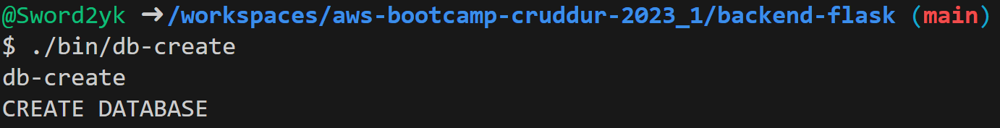
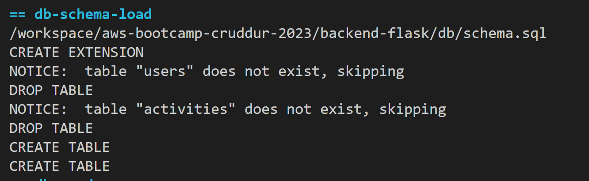
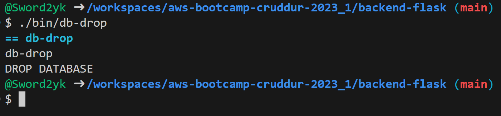
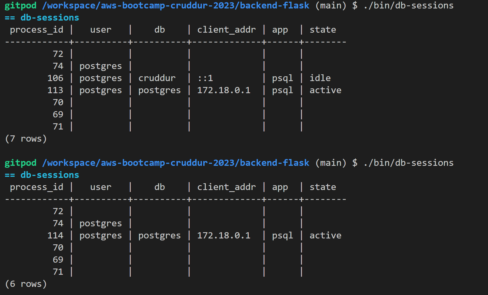
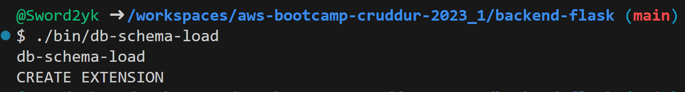

# Postgres and RDS Required Homework

## PSQL Database Creation

### createdb — create a new PostgreSQL database

I use the createdb command to create our database

    createdb cruddur -h localhost -U postgres



I use below command to connect to PSQL Client and  list the database(s).

    psql -U postgres -h localhost
    


## Create a `Schema.sql` for creating tables and Add UUID Extension

Create a new directory `db` in `the \backend-flask\` directory and add a new file `schema.sql` with the content below:

 ```sql
      
      CREATE EXTENSION IF NOT EXISTS "uuid-ossp";
      DROP TABLE IF EXISTS public.users;
      DROP TABLE IF EXISTS public.activities;


      CREATE TABLE public.users (
        uuid UUID DEFAULT uuid_generate_v4() PRIMARY KEY,
        display_name text NOT NULL,
        handle text NOT NULL,
        email text NOT NULL,
        cognito_user_id text NOT NULL,
        created_at TIMESTAMP default current_timestamp NOT NULL
      );
      
      CREATE TABLE public.activities (
        uuid UUID DEFAULT uuid_generate_v4() PRIMARY KEY,
        user_uuid UUID NOT NULL,
        message text NOT NULL,
        replies_count integer DEFAULT 0,
        reposts_count integer DEFAULT 0,
        likes_count integer DEFAULT 0,
        reply_to_activity_uuid integer,
        expires_at TIMESTAMP,
        created_at TIMESTAMP default current_timestamp NOT NULL
      );
  ```
  
  
## Shell script for PSQL Database Connecting

I created a new directory called `bin`

    mkdir /workspace/aws-bootcamp-cruddur-2023/backend-flask/bin

I created a new bash script bin/db-connect content below:

    #! /usr/bin/bash

    psql $CONNECTION_URL
    
## Shell script to  drop the PSQL Database

I created a new file `db-drop` in the `bin` directory.

     #! /usr/bin/bash
     
     NO_DB_CONNECTION_URL=$(sed 's/\/cruddur//g' <<<"$CONNECTION_URL")
     psql $NO_DB_CONNECTION_URL -c "drop database cruddur;"
 
 
 
## Shell script for PSQL Database Connection Sessions

`db-session` file in the `bin` directory.

 ```bash   
    #! /usr/bin/bash
    if [ "$1" = "prod" ]; then
    echo "Running in production mode"
    URL=$PROD_CONNECTION_URL
    else
      URL=$CONNECTION_URL
    fi
    
    NO_DB_URL=$(sed 's/\/cruddur//g' <<<"$URL")
    psql $NO_DB_URL -c "select pid as process_id, \
           usename as user,  \
           datname as db, \
           client_addr, \
           application_name as app,\
           state \
    from pg_stat_activity;"
 ```
 
 
 ## Shell script to load the schema to the PSQL Database
 
 `db-shema` file in th `bin` directory.
 
 ```bash
    #! /usr/bin/bash
    
    schema_path="$(realpath .)/db/schema.sql"
    echo $schema_path
    
    if [ "$1" = "prod" ]; then
      echo "Running in production mode"
      URL=$PROD_CONNECTION_URL
    else
      URL=$CONNECTION_URL
    fi
    
    psql $URL cruddur < $schema_path
 ``` 
 
 
 ## Shell script to load the seed data to the PSQL Database
 
 Insert seed data to the PSQL database.
 `db-seed` file in th `bin` directory.
 
 ```bash
    #! /usr/bin/bash
    seed_path="$(realpath .)/db/seed.sql"
    echo $seed_path
    
    if [ "$1" = "prod" ]; then
      echo "Running in production mode"
      URL=$PROD_CONNECTION_URL
    else
      URL=$CONNECTION_URL
    fi

    psql $URL cruddur < $seed_path
    
 ```
 
 ## Sell script for easy PSQL Database Setup
 
 `db-setup` file in th `bin` directory.
 ```bash
    bin_path="$(realpath .)/bin"

    source "$bin_path/db-drop"
    source "$bin_path/db-create"
    source "$bin_path/db-schema-load"
    source "$bin_path/db-seed"
 ```
 
 
