# Week 5 — DynamoDB and Serverless Caching
# Required Homework

## NOSQL

NoSQL, also referred to as “not only SQL”, “non-SQL”, is an approach to database design that enables the storage and querying of data outside the traditional structures found in relational databases.<br>
NoSQL databases use a variety of data models for accessing and managing data. These types of databases are optimized specifically for applications that require large data volume, low latency, and flexible data models, which are achieved by relaxing some of the data consistency restrictions of other databases.<br>

## Amazon DynamoDB
Amazon DynamoDB is a fully managed, serverless, key-value NoSQL database designed to run high-performance applications at any scale. DynamoDB offers built-in security, continuous backups, automated multi-Region replication, in-memory caching, and data import and export tools.<br>

### High availability and durability

DynamoDB automatically spreads the data and traffic for your tables over a sufficient number of servers to handle your throughput and storage requirements, while maintaining consistent and fast performance. All of your data is stored on solid-state disks (SSDs) and is automatically replicated across multiple Availability Zones in an AWS Region, providing built-in high availability and data durability.

## DynamoDB data model

A DynamoDB table design corresponds to the relational order entry schema that is shown in Relational modeling. It follows the Adjacency list design pattern, which is a common way to represent relational data structures in DynamoDB.<br>

### Modelling

DynamoDB Single-Table Design Process is iterative and consists of the following steps: <br>

<ul>
  <li>Determine the application entities and relationships.</li>
  <li>Determine all the access patterns.</li>
  <li>Determine the key structure and entity key values.</li>
  <li>Codify the design as a OneTable schema.</li>
  <li>Create OneTable migration scripts to populate the table with test data.</li>
  <li>Prototype queries to satisfy each of the access patterns.</li>
  <li>Repeat and refine.</li>
</ul>

For Cruddur app, the interactive data is divided into four different patterns.
<ol>
  <li>Pattern A: Display Messages in Message Group</li>
  <li>Pattern B: Display Group Messages</li>
  <li>Pattern C: Message for an existing Message Group</li>
  <li>Pattern D: Message for a new Message Group</li>
</ol>

## Backend Utility Setup
<ul>
  <li>Amazon Relational Database Service (RDS): backend-flask/bin/rds.</li>
  <li>Postgres database: backend-flask/bin/db .</li>
  <li>DynamoDB: backend-flask/bin/ddb.</li>
  <li>AWS Cognito: backend-flask/bin/cognoto.</li>
</ul>

[Commits](https://github.com/Sword2yk/aws-bootcamp-cruddur-2023/commit/0c148395b41fc62f1ac082097d0acb9b59476025)

Update `backend-flask/requirements.txt` with `boto3`; AWS SDK for Python (Boto3) to create, configure, and manage AWS services, such as Amazon Elastic Compute Cloud (Amazon EC2) and Amazon Simple Storage Service (Amazon S3).
<br>
Add command in `.gitpod.yml` for auto installation of python libraries in the workspace.
<br>

## Postgres Database Utility Scripts

`backend-flask/bin/db/create` script: Create cruddur app database. `create database cruddur;`
`backend-flask/bin/db/connect` script: Connect to cruddur. `postgresql://postgres:password@db:5432/cruddur`
`backend-flask/bin/db/schema-load` script: Create tables `users` and `activities` tables in the cruddur database.
`backend-flask/bin/db/seed` script: Update and add users in the users table.
`backend-flask/bin/cognito/list-users` script: To match users in the seed data with the one on cognito.
`backend-flask/bin/db/setup` script for a quick db setup.

DB Setup and Cognito user list
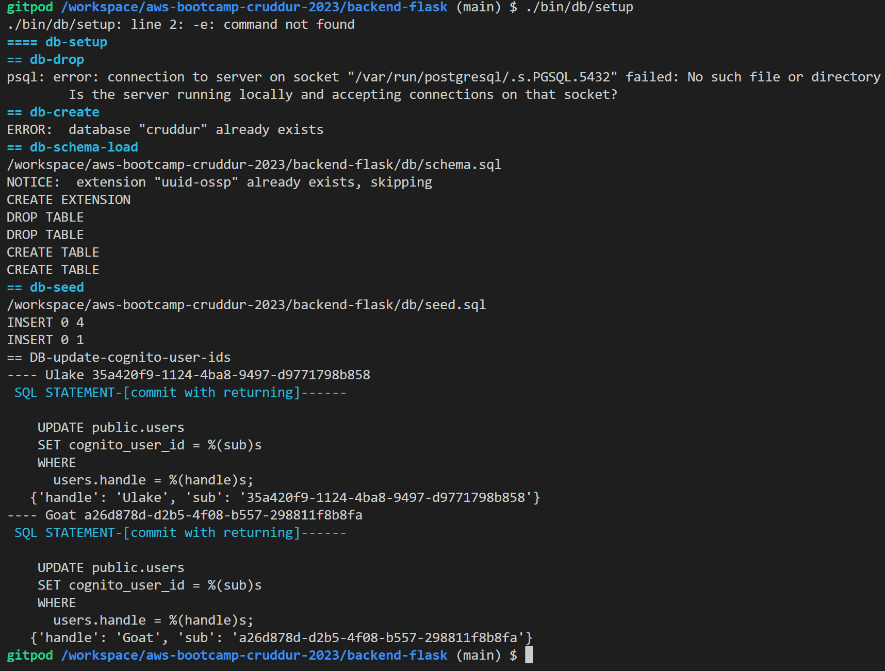

USER LIST
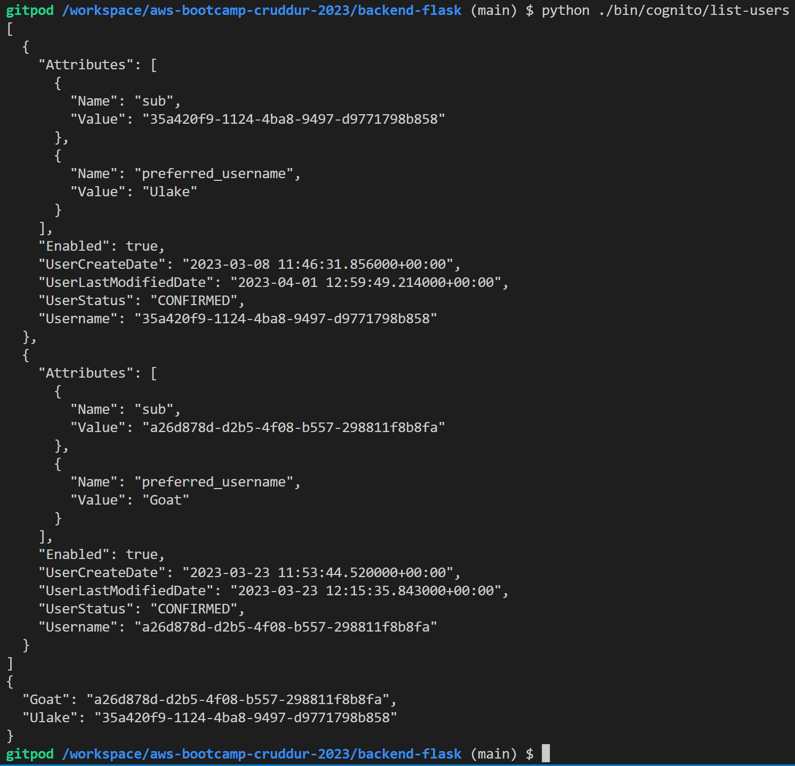


## DynamoDB Utility Scripts

### Drop DynamoDB Script.
`/ddb/drop` script.

Drop table
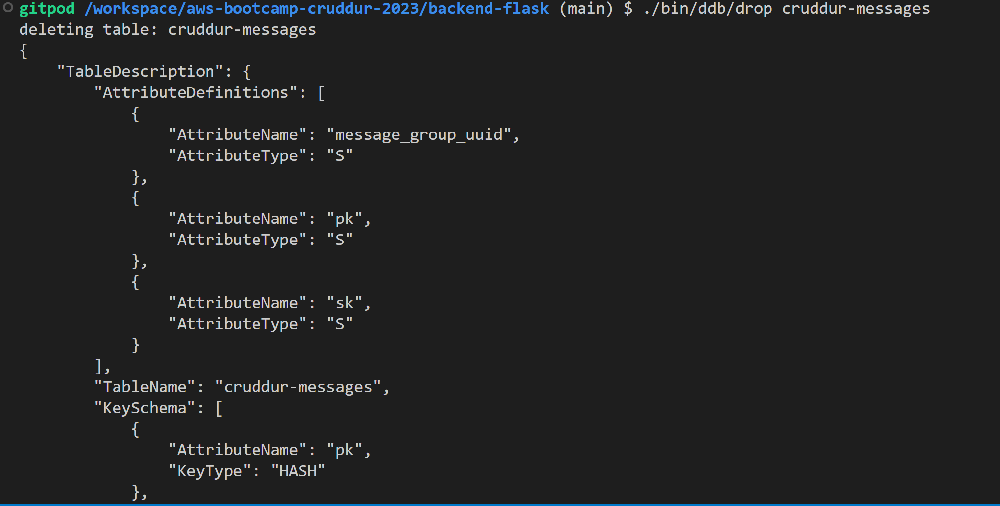

### Schema Load Implementation
Create a schema script `schema-load` to create the dynamoDB table.<br>
Schema Load
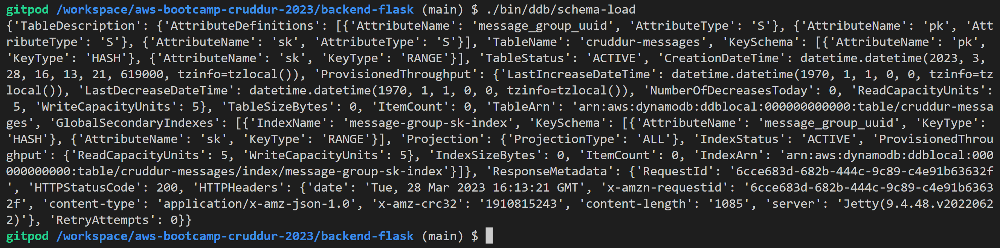

### List Tables Script
`/ddb/list-tables` script.

List table
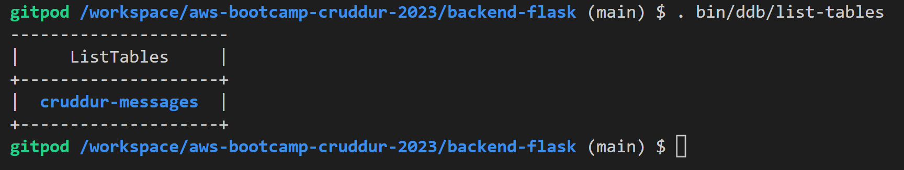

### Seed Data Implementation
`/bin/ddb/seed` script.

Seed
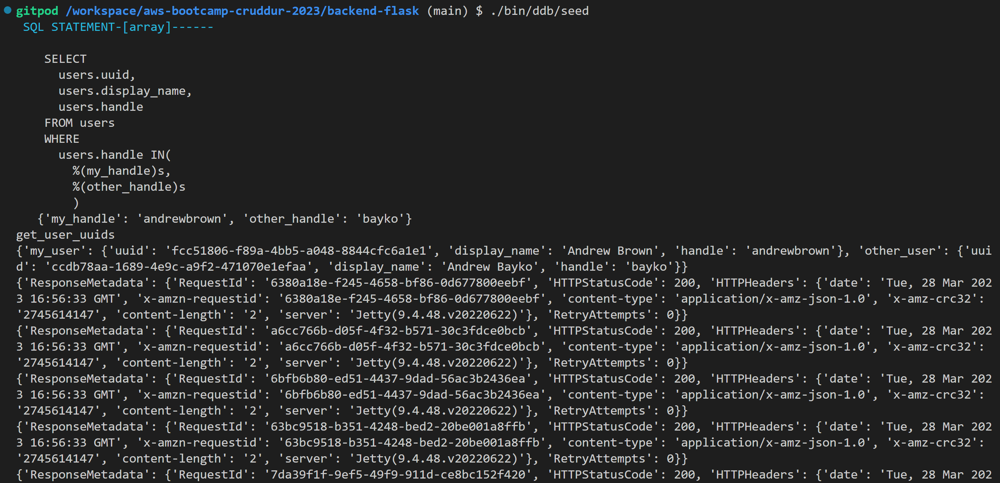

### Scan Data Script
`/bin/ddb/scan` scripts.
Scan Data
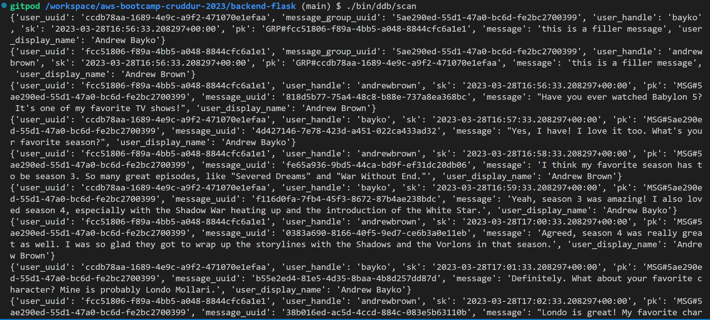

### Get Conversation Script
`/bin/ddb/patterns/get-conversation` script.<br>

Get Conversation
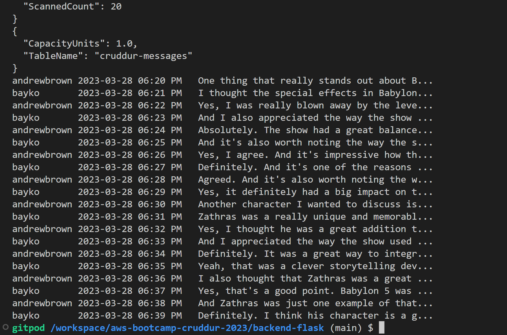

### List Conversation Script
`/bin/ddb/patterns/list-conversations` script.<br>

List Conversation
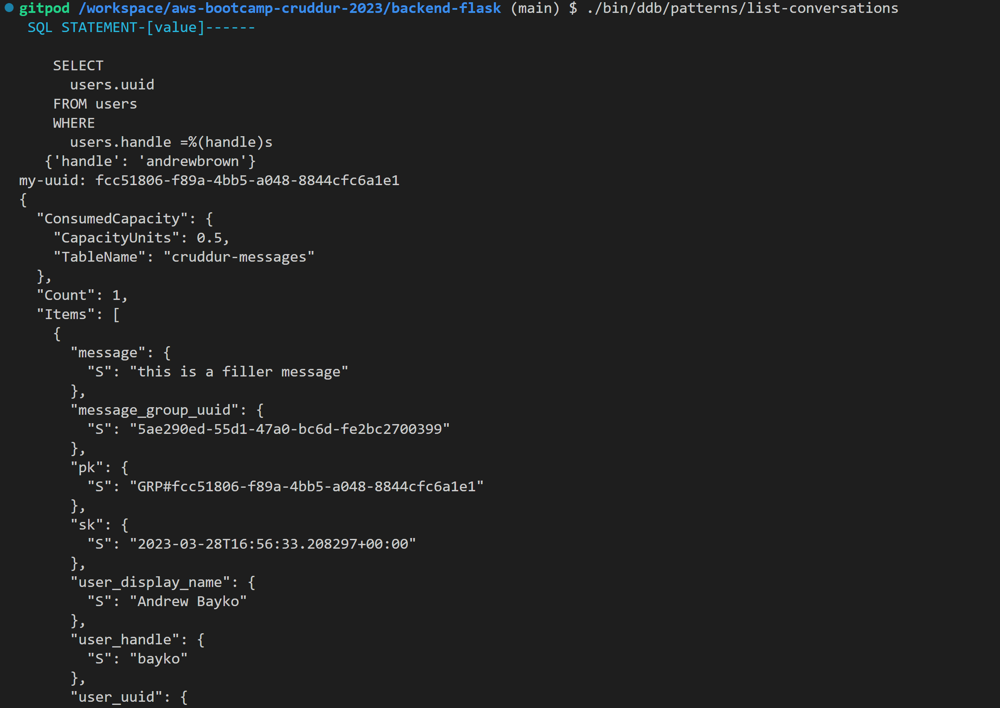

## DynamoDB Local Implementation of Conversation

Set `AWS_ENDPOUNT_URL: 'http://dynamodb-local:8000'` in the `dockers-compose.yml`.
### Backend
Update the routes and functions in the backend to pipe the messages from the Dynamodb local.
Change the use of `handle` to use `message-group_uuid`:

- `backend-flask/app.py` `"/api/messages/<string:message_group_uuid>"`
- `backend-flask/services/messages.py`
- `backend-flask/services/message_groups.py`
- Template `backend-flask/db/sql/users/uuid_from_cognito_user_id.sql`

### Frontend

I update below js files on the frontend by removing cookies and adding authentication to the pages

- HomeFeedPage - `frontend-react-js/src/pages/HomeFeedPage.js`
- MessageGroupPage - `frontend-react-js/src/pages/MessageGroupPage.js`
- MessageGroupsPage - `frontend-react-js/src/pages/MessageGroupsPage.js`
- MessageForm - `frontend-react-js/src/components/MessageForm.js`
- Create `frontend-react-js/src/lib/CheckAuth.js` for authentication reuse.

### New Message
- Update `create_message.py` `backend-flask/services/create_message.py`, modify below files.
- Function in the `backend-flask/app.py` (`data_create_message`).
- Update the content in the `MessageForm.js` file `frontend-react-js/src/components/MessageForm.js`.
- Create a template `backend-flask/db/sql/users/create_message_users.sql`.

### Message Group

- Update `frontend-react-js/src/components/MessageGroupFeed.js`
- Create a new .js file `frontend-react-js/src/pages/MessageGroupNewPage.js` and add the route to the `frontend-react-js/src/App.js`.
- Update the MessageGroupNewItem component `frontend-react-js/src/components/MessageGroupNewItem.js`
- Create users_short `backend-flask/services/users_short.py`
- Create a template `backend-flask/db/sql/users/short.sql`

#### Messages tab for the seed data that displays the Conversation

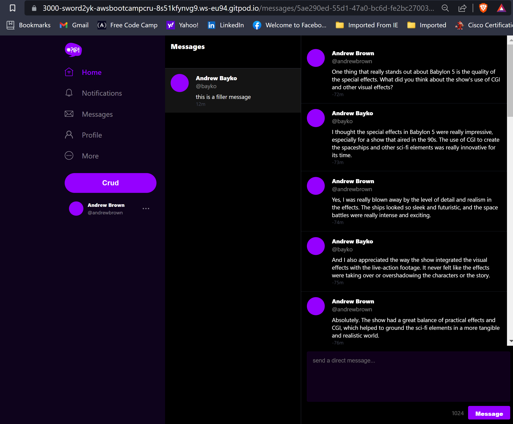

#### New Message

Using the url `https://<frontend_address>/messages/new/<handle>` to create a new message group or start a new conversation with other users.

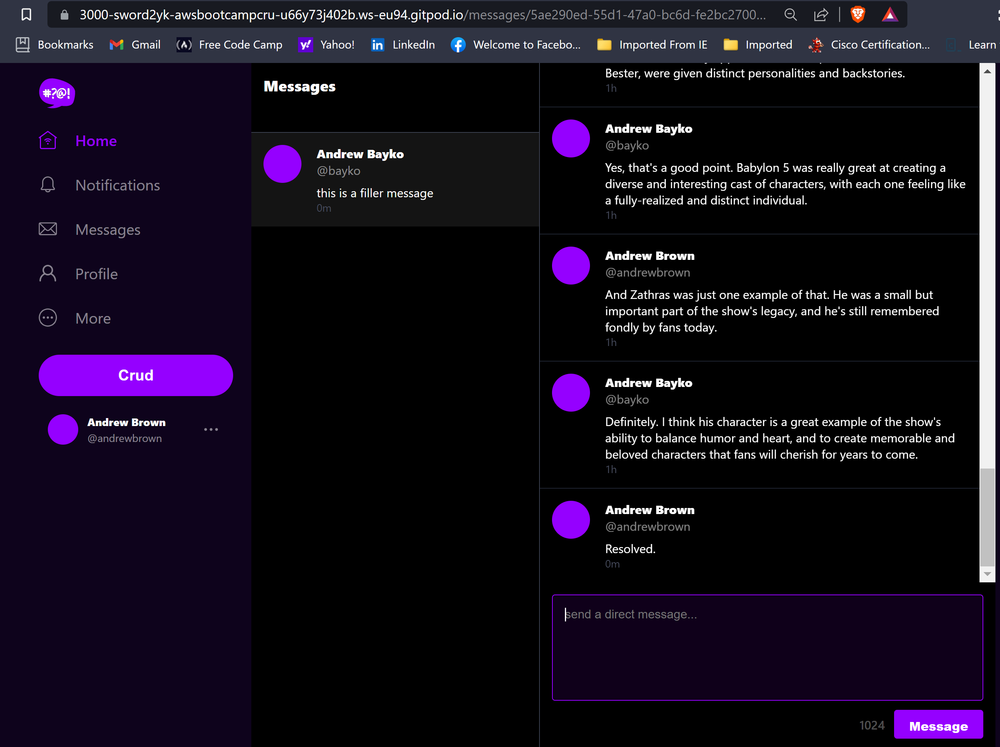

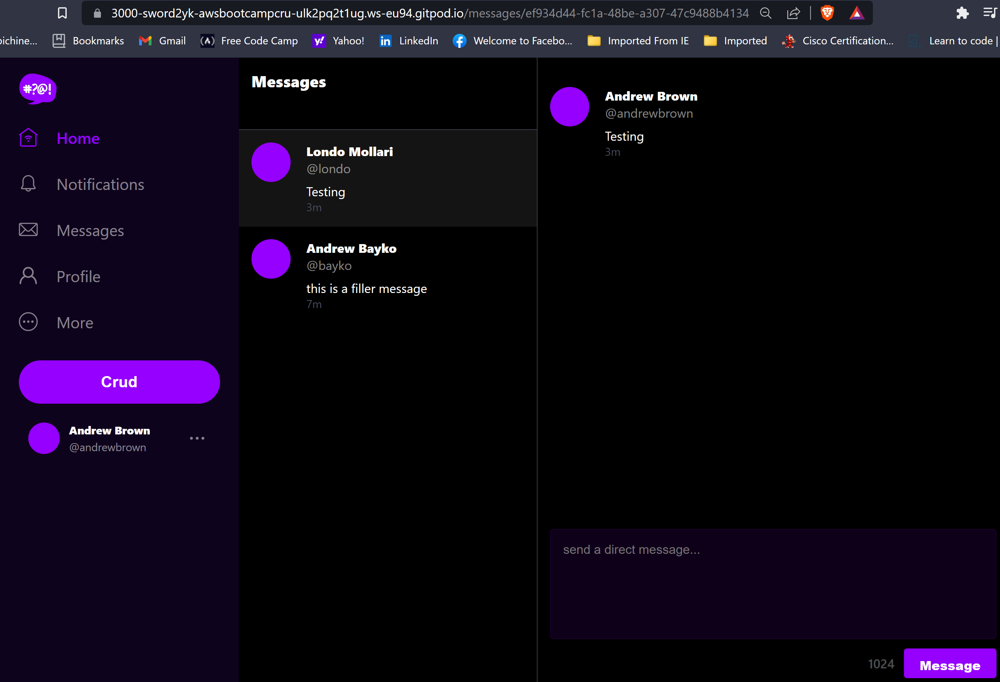


## DynamoDB Stream with AWS Lambda

- Update `docker-compose.yml` file by commenting out #`AWS_ENDPOINT_URL` and recompose the file.
- Create DynamoDB table on AWS by running `./bin/ddb/schema-load prod`.
- Turn on the DynamoDB stream by selecting 'new image' on the AWS DynamoDB cruddur-messages table.
- Create a VPC endpoint `cruddur-ddb` select `default VPC`, security group and route table for DynamoDB services.
- Create a new Lambda function on the AWS Lambda console named `cruddur-messaging-stream` attach the VPC, security group and route. Add permission for the IAM role `AWSLambdaInvocation-DynamoDB` and `aws/policies/cruddur-message-stream-policy.json`.
`cruddur-message-stream-policy.json`

 ```json
   {
      "Version": "2012-10-17",
      "Statement": [
          {
              "Sid": "VisualEditor0",
              "Effect": "Allow",
              "Action": [
                  "dynamodb:PutItem",
                  "dynamodb:DeleteItem",
                  "dynamodb:Query"
              ],
              "Resource": [
                  "arn:aws:dynamodb:us-east-1:289043571302:table/cruddur-messages",
                  "arn:aws:dynamodb:us-east-1:289043571302:table/cruddur-messages/index/message-group-sk-index"
              ]
          }
      ]
   }
```
- Add a trigger to the AWS DynamoDB table `cruddur-messages`.
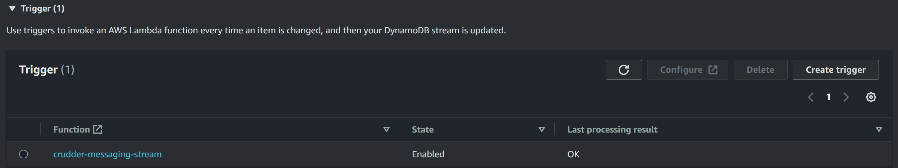

#### DynamoDB Stream
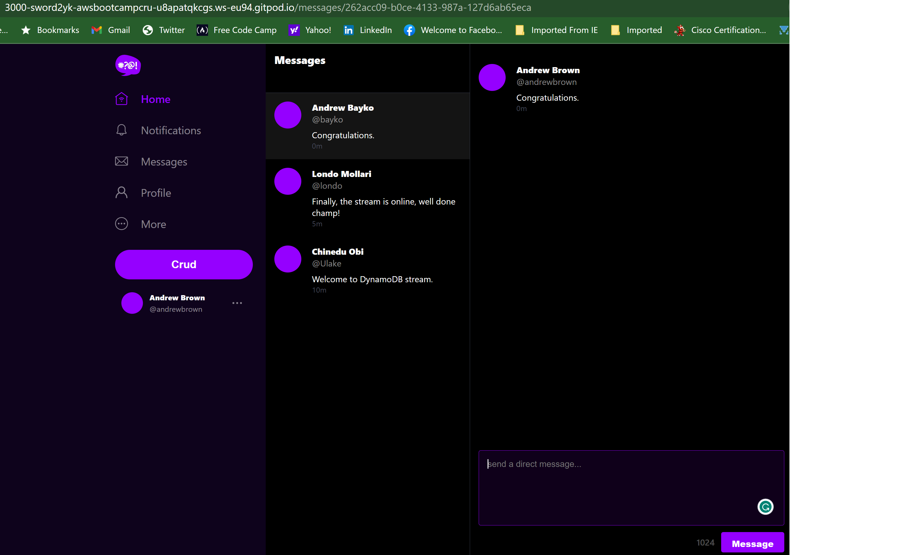

#### Cloudwatch Logs
No error detected.
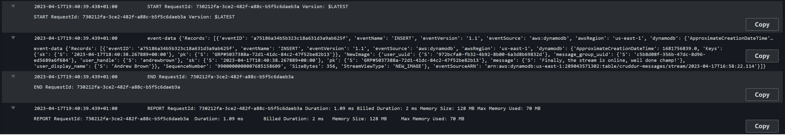

## Reference

<ol>
	
<li>
     
  [Dynamodb Guide](https://www.dynamodbguide.com/what-is-dynamo-db) </li>


<li>
     
  [Modeling relational data in DynamoDB](https://docs.aws.amazon.com/amazondynamodb/latest/developerguide/bp-modeling-nosql-B.html) </li>

<li>
  
  [NoSQL databases](https://aws.amazon.com/nosql/#:~:text=NoSQL%20databases%20use%20a%20variety,consistency%20restrictions%20of%20other%20databases.) </li>

  
</ol>
