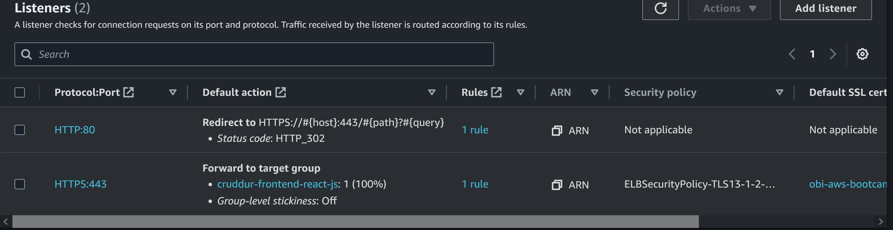
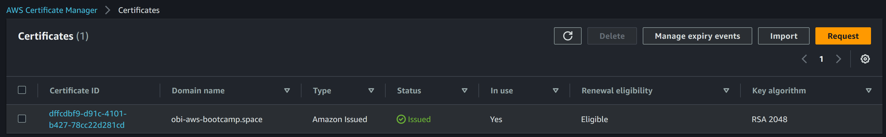
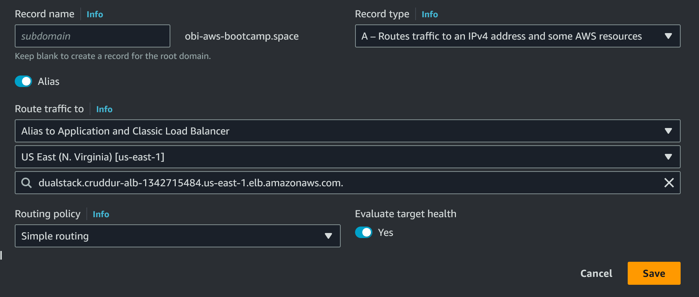
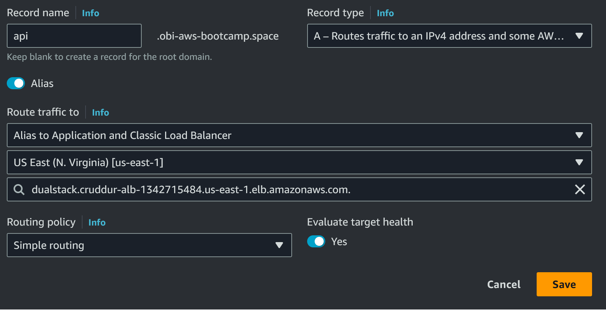

# Week 6 — Deploying Containers

## Required Homework.

### Amazon Elastic Container Service (Amazon ECS).
Amazon Elastic Container Service (Amazon ECS) is a fully managed container orchestration service that helps you easily deploy, manage, and scale containerized applications. As a fully managed service, Amazon ECS comes with AWS configuration and operational best practices built-in. It's integrated with both AWS and third-party tools, such as Amazon Elastic Container Registry and Docker. This integration makes it easier for teams to focus on building the applications, not the environment. You can run and scale your container workloads across AWS Regions in the cloud, and on-premises, without the complexity of managing a control plane.<br>

### Layers in Amazon ECS.

<ul>
  <li>Capacity - The infrastructure where your containers run.</li>
  <li>Controller - Deploy and manage your applications that run on the containers.</li>
  <li>Provisioning - The tools that you can use to interface with the scheduler to deploy and manage your applications and containers.</li>
</ul>

## Steps and Activities
### Amazon Relational Database Service (RDS) Connection.
I created a script `test` to check the connection to RDS from the container.
`chmod u+x bin/db/test` to make the script executable.

```python
      #!/usr/bin/env python3
    
    import psycopg
    import os
    import sys
    
    connection_url = os.getenv("CONNECTION_URL")
    
    conn = None
    try:
      print('attempting connection')
      conn = psycopg.connect(connection_url)
      print("Connection successful!")
    except psycopg.Error as e:
      print("Unable to connect to the database:", e)
    finally:
      conn.close()
      
 ```
 ### Health Check for the flash app.
 In the directory `./backend-flask/bin/ ` I created a `health-check program` for the flask app.<br>
 
 ```python
      #!/usr/bin/env python3

      import urllib.request

      response = urllib.request.urlopen('http://localhost:4567/api/health-check')
      if response.getcode() == 200:
        print("Flask server is running")
      else:
        print("Flask server is not running")
 ```
 
 While on the flask app, health-check code was added.<br>
 
 ```python
    @app.route('/api/health-check')
    def health_check():
     return {'success': True}, 200
  
 ```
 ### Create a CloudWatch Log Group.
 I created an Amazon CloudWatch Logs to monitor, store, and access your log files from Amazon Elastic Compute Cloud (Amazon EC2) instances.<br>
 Log-group-name: `cruddur`
 
 ```bash
    aws logs create-log-group --log-group-name cruddur
    aws logs put-retention-policy --log-group-name cruddur --retention-in-days 1
 ```
 ## Amazon ECS clusters.
An Amazon ECS cluster groups together tasks, and services, and allows for shared capacity and common configurations. An Amazon ECS cluster is a logical grouping of tasks or services. Your tasks and services are run on infrastructure that is registered to a cluster. The infrastructure capacity can be provided by AWS Fargate, which is serverless infrastructure that AWS manages, Amazon EC2 instances that you manage, or an on-premise server or virtual machine (VM) that you manage remotely.<br>
 
 ### ECS Cluster Creation for Cruddur Services.
 I created the ecs cluster for cruddur services.<br>
 ECS Cluster name: `cruddur`.
 
 ```aws
    aws ecs create-cluster \
      --cluster-name cruddur \
      --service-connect-defaults namespace=cruddur
 ```
Note the Cluster `GroupId` and security group `cruddur-ecs-cluster-sg`.

## Accessing the ECS Fargate Container
Amazon Elastic Container Registry (Amazon ECR) is a managed AWS container image registry service that is secure, scalable, and reliable.<br>

### Login to Elastic Container Registry (Amazon ECR).
Login to the ECR to able create and push images.
bash script for easy login: `.\bin\ecr\login`

```aws
   aws ecr get-login-password --region $AWS_DEFAULT_REGION | docker login --username AWS --password-stdin "$AWS_ACCOUNT_ID.dkr.ecr.$AWS_DEFAULT_REGION.amazonaws.com"
```
### ECR Repo.
AWS provided base images for Lambda contain all the required components to run your functions packaged as container images on AWS Lambda. These base images contain the Amazon Linux Base operating system, the runtime for a given language, dependencies and the Lambda Runtime Interface Client (RIC), which implements the Lambda Runtime API. The Lambda Runtime Interface Client allows your runtime to receive requests from and send requests to the Lambda service.<br>
Python Repository:`cruddur-python`.<br>
```aws
    aws ecr create-repository \
    --repository-name cruddur-python \
    --image-tag-mutability MUTABLE
```
Backend-flask Repository:`backend-flask`
```aws
    aws ecr create-repository \
      --repository-name backend-flask \
      --image-tag-mutability MUTABLE
```
Frontend-react-js Repository:`frontend-react-j`.
```aws
    aws ecr create-repository \
      --repository-name frontend-react-js \
      --image-tag-mutability MUTABLE
```
### AWS env vars.

```aws
    export ECR_PYTHON_URL="$AWS_ACCOUNT_ID.dkr.ecr.$AWS_DEFAULT_REGION.amazonaws.com/cruddur-python"
    echo $ECR_PYTHON
    
    export ECR_FRONTEND_REACT_URL="$AWS_ACCOUNT_ID.dkr.ecr.$AWS_DEFAULT_REGION.amazonaws.com/frontend-react-js"
    echo $ECR_FRONTEND_REACT_URL
    
    export ECR_BACKEND_FLASK_URL="$AWS_ACCOUNT_ID.dkr.ecr.$AWS_DEFAULT_REGION.amazonaws.com/backend-flask"
    echo $ECR_BACKEND_FLASK_URLL
```
## Backend and Frontend Images.
Pull the base-image python, tag and push it to Amazon ECR repositories `cruddur-python`.<br>
`./bin/ecr/login` <br>
`pull` -> `tag` -> `push`
```aws
   docker pull python:3.10-slim-buster
   docker tag python:3.10-slim-buster $ECR_PYTHON_URL:3.10-slim-buster
   docker push $ECR_PYTHON_URL:3.10-slim-buster
```
### Backend image for development and production.
Add the health-check to `./backend-flask/app.py` [commit](commit/33ac3b1132b3c04d9fbc82dfd98b59c304a56f24) to route the health checks.
In this [commit](b3f1b94cc3c28fe237589dd1072cc2c0a57a3896), backedn-flask Dockerfile was updated for development and production with the flask app secured not to run in debug mode.

```
  ./bin/backend/build
  ./bin/backend/push

```
### Frontend image.
I created `frontend-react-js\Dockerfile.prod` and `nginx.conf`. Resolved the token issue '[commit](848808b5a004bc6a9abddceb05c0fa8ed6c7411f)'.
Build and push the frontend image to ECR.

```
  ./bin/frontend/build
  ./bin/frontend/push
  
```
#### Amazon ECR.
Amazon ECR Repo for `cruddur-python`, `backend-flask`, and `frontend-react-js`.


## Register Task Definitions.
Passing senstive data to AWS for running `backend-flask` services.

```
   aws ssm put-parameter --type "SecureString" --name "/cruddur/backend-flask/AWS_ACCESS_KEY_ID" --value $AWS_ACCESS_KEY_ID
   aws ssm put-parameter --type "SecureString" --name "/cruddur/backend-flask/AWS_SECRET_ACCESS_KEY" --value $AWS_SECRET_ACCESS_KEY
   aws ssm put-parameter --type "SecureString" --name "/cruddur/backend-flask/CONNECTION_URL" --value $PROD_CONNECTION_URL
   aws ssm put-parameter --type "SecureString" --name "/cruddur/backend-flask/ROLLBAR_ACCESS_TOKEN" --value $ROLLBAR_ACCESS_TOKEN
   aws ssm put-parameter --type "SecureString" --name "/cruddur/backend-flask/OTEL_EXPORTER_OTLP_HEADERS" --value "x-honeycomb-team=$HONEYCOMB_API_KEY"
```

### AWS IAM Roles.

In aws directory `/aws/policies/` add the policies for `CruddurServiceExecutionRole` and `CruddurServiceExecutionPolicy`.

##### aws/policies/service-assume-role-execution-policy.json

```json
    {
      "Version":"2012-10-17",
      "Statement":[{
          "Action":["sts:AssumeRole"],
          "Effect":"Allow",
          "Principal":{
            "Service":["ecs-tasks.amazonaws.com"]
        }}]
    }
```
##### aws/policies/service-execution-policy.json

```json
    {
      "Version":"2012-10-17",
      "Statement":[{
        "Effect": "Allow",
        "Action": [
          "ssm:GetParameters",
          "ssm:GetParameter"
        ],
        "Resource": "arn:aws:ssm:us-east-1:289043571302:parameter/cruddur/backend-flask/*"
      }]
    }
```
```aws
    aws iam create-role \
        --role-name CruddurServiceExecutionRole \
        --assume-role-policy-document file://aws/policies/service-assume-role-execution-policy.json
```
```aws
    aws iam put-role-policy \
        --policy-name CruddurServiceExecutionPolicy \
        --role-name CruddurServiceExecutionRole  \
        --policy-document file://aws/policies/service-execution-policy.json
 ```
##### Task Role.
`CruddurTaskRole`
```script
    aws iam create-role \
        --role-name CruddurTaskRole \
        --assume-role-policy-document "{
      \"Version\":\"2012-10-17\",
      \"Statement\":[{
        \"Action\":[\"sts:AssumeRole\"],
        \"Effect\":\"Allow\",
        \"Principal\":{
          \"Service\":[\"ecs-tasks.amazonaws.com\"]
        }
      }]
    }"
```
```script
    aws iam put-role-policy \
      --policy-name SSMAccessPolicy \
      --role-name CruddurTaskRole \
      --policy-document "{
      \"Version\":\"2012-10-17\",
      \"Statement\":[{
        \"Action\":[
          \"ssmmessages:CreateControlChannel\",
          \"ssmmessages:CreateDataChannel\",
          \"ssmmessages:OpenControlChannel\",
          \"ssmmessages:OpenDataChannel\"
        ],
        \"Effect\":\"Allow\",
        \"Resource\":\"*\"
      }]
    }"
```
```script
  aws iam attach-role-policy \
    --policy-arn arn:aws:iam::aws:policy/CloudWatchFullAccess \
    --role-name CruddurTaskRole
```
```script
  aws iam attach-role-policy \
    --policy-arn arn:aws:iam::aws:policy/AWSXRayDaemonWriteAccess \
    --role-name CruddurTaskRole
```

### Security Groups, VPC ID and SUBNET IDs.
Print out the `DEFAULT_VPC_ID` and `DEFAULT_SUBNET_IDS` to create the security group: `crud-srv-sg`.

Print out `DEFAULT_VPC_ID`
```
  export DEFAULT_VPC_ID=$(aws ec2 describe-vpcs \
  --filters "Name=isDefault, Values=true" \
  --query "Vpcs[0].VpcId" \
  --output text)
  echo $DEFAULT_VPC_ID
```
Print out `EFAULT_SUBNET_IDS` 
```
  export DEFAULT_SUBNET_IDS=$(aws ec2 describe-subnets  \
   --filters Name=vpc-id,Values=$DEFAULT_VPC_ID \
   --query 'Subnets[*].SubnetId' \
   --output json | jq -r 'join(",")')
  echo $DEFAULT_SUBNET_IDS
```
Create the security group `crud-srv-sg`
```
  export CRUD_SERVICE_SG=$(aws ec2 create-security-group \
    --group-name "crud-srv-sg" \
    --description "Security group for Cruddur services on ECS" \
    --vpc-id $DEFAULT_VPC_ID \
    --query "GroupId" --output text)
  echo $CRUD_SERVICE_SG
```
Add the inbound rules for port 4567 and 3000. Link the security group to access RDS port 5432.<br>

### Application Load Balancer.
Elastic Load Balancing automatically distributes your incoming traffic across multiple targets, such as EC2 instances, containers, and IP addresses, in one or more Availability Zones. It monitors the health of its registered targets, and routes traffic only to the healthy targets. Elastic Load Balancing scales your load balancer as your incoming traffic changes over time. It can automatically scale to the vast majority of workloads.<br>
Configure an internet facing, IPv4 address type application load balancer.<br>

```
  aws elbv2 create-load-balancer \
      --name cruddur-alb \
      --subnets subnet-0357b39d5e86fb547 subnet-0d8773266a0c522b4 \
      --security-groups sg-0fd045c29ee62f235
```
##### Add listeners.
HTTP:80 and HTTPS:443.<br>


Edit HTTPS:443 manage rule and insert rule host path and action Forward to `cruddur-backend-flask-tg`


## Amazon Route 53, Hosted zone, and Domain Configuration.
#### Amazon Route 53
Amazon Route 53 is a highly available and scalable Domain Name System (DNS) web service. You can use Route 53 to perform three main functions in any combination: domain registration, DNS routing, and health checking.<br>

#### Hosted zone.
A hosted zone is a container for records, and records contain information about how you want to route traffic for a specific domain, such as example.com, and its subdomains (acme.example.com, zenith.example.com). A hosted zone and the corresponding domain have the same name.<br>

My registered domain name is `obi-aws-bootcamp.space` for the aws bootcamp. Route 53 can be use to manage the doiman via hosted zone.
Create an SSL certificate with AWS Certificate Manager (ACM).


#### Create record.
Create a record type A-Routes traffic to an IPv4 address and some AWS resources with a simple routing policy.
Record name: `obi-aws-bootcamp.space`

Record name: `api.obi-aws-bootcamp.space`



